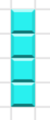
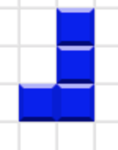
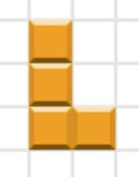
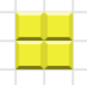
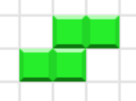
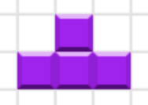
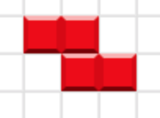
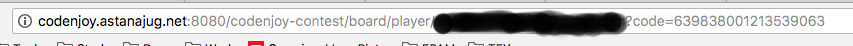

Мы думаем, что каждый из вас в детсве убил немало времени играя в Tetris. Сегодня мы предлагаем вам окунуться в прошлое и предлагаем написать бота, который будет играть в тетрис. Ваш бот будет получать состояние поля по которому ползет змейка от нашего сервера, размещенного [здесь](http://codenjoy.astanajug.net:8080/contest). Мы предлагаем вам создать бота используя одну из следующих платформ:

* Java
* .Net
* Node.js

# Правила игры

Правило игры просто как два байта послать - набрать наибольшее количество очков.
Набор очков достигается за счет сброса блочных фигур и сжигания полноценных линий сложенных из блоков:

+ сжигание одной линии блоков дает +10 очков
+ сжигание двух линий блоков дает +20 очков
+ сжигание трех линий блоков дает +30 очков
+ сжигание четырех линий блоков дает +40 очков
+ сброс различных типов фигур дает разное количество очков
  +  фигура I не дает очков
  +  фигура J дает +1 очко
  +  фигура L дает +2 очка
  +  фигура O дает +3 очка
  +  фигура S дает +4 очка
  +  фигура T дает +5 очков
  +  фигура Z дает +6 очков

# Регистрация игрового бота
Прежде чем приступать к реализации вашего бота необходимо пройти регистрацию вашего бота на сервере. Для этого переходим по адресу http://codenjoy.astanajug.net:8080/contest/register. В открывшейся форме указываем следующие данные:

* email с которым будет ассоциирован ваш бот
* пароль
 
После того как вы завершите регистрацию вам необходимо запомнить (а лучше записать) code, который был присвоем вашему боту. Найти его можно будет в адресной строке, на странице вашего персонального поля, на котором идет игра.



В случае если вы забыли ваш code, вы можете пройти на страницу регистрации указать логин и пароль, которые вы использовали ранее для регистрации. И сервер снова перенаправит вас на ваше персональное игровое поле.

Логин и код в дальнейшем необходимо будет указать в клиенте вашего бота для подключения к серверу игры

# Как работать с сервером

От сервера каждую секунду приходит сообщение, которое содержит состояние игрового поля для игрока. Пример строки вы можете увидеть ниже:

```
board={
    "currentFigureType":"Z",
    "futureFigures":["T","S","S","T"],
    "layers":["       ZZ              Z               I               I               I               I               J               J              JJ              S               SS               SZ              ZZ              Z               OO              OO       "],
    "currentFigurePoint":"[7,15]"}
```

Если присмотреться внимательно, то состояние игрового поля описывается JSON сообщение. Для извлечения данного сообщения можно воспользоваться следующим regexp выражением ```^board=(.*)$```

JSON сообщение содержит следующую информацию:

+ currentFigureType - текущая фигура, для которой будут отправляться команды серверу
+ futureFigures - следующие четыере фигуры, которые будут предоставлены игроку сервером
+ layers - состояние игорового стакана игрока в виде строки. Размерность стакана 16 на 16
+ currentFigurePoint - координаты левого верхнего блока фигуры на системе координат игрового поля

В течение секунды вашему боту необходимо будет разобрать состояние поля, принять решение что сделать и отправить команду на сервер

Если в течение секунды сервер не получит от вашего бота команды для действия фигуры, то она продолжит движение по инерции.

## Символы обозначающие состояние ячейки игрового поля

Каждая ячейка игроового поля может быть представлена следующими символами:

* ```' ' ``` (пустая поле) - данная ячейка пуста
* ```'I'``` - поле принадлежит фигуре I
* ```'J'``` - поле принадлежит фигуре J
* ```'L'``` - поле принадлежит фигуре L
* ```'O'``` - поле принадлежит фигуре O
* ```'S'``` - поле принадлежит фигуре S
* ```'T'``` - поле принадлежит фигуре T
* ```'Z'``` - поле принадлежит фигуре Z

## Команды для задания направления движения змейки

Для задания направления движения змейки вы можете использовать следующие команды:

* ```LEFT``` - переместить фигуру влеов
* ```RIGHT``` - переместить фигуру вправо
* ```DOWN``` - бросить фигуру вниз
* ```ACT``` - повернуть фигуру

Надеемся, что вам понравится провести время, получая удовольствие от решения нашей задачи.

## Локальный север

Чтобы исключить проблем работы с сетью при разработке бота, вы можете использовать локальный сервер, который можно запустить с использованием docker. Для этого вам необходимо установить [docker engine community](https://www.docker.com/products/docker-engine). После установки сервера выполните команду 

```docker run --name astana-codenjoy-local -d -p 8080:8080 esvalukhin/astana-codenjoy```

Данная команда скачает образ игры на ваш локальный компьютер и после запустит в фоновом режиме. После запуска сервера ваш локальный сервер будет доступен [здесь](http://localhost:8080/contest/)

По окончании использования сервера вы можете остановить его выполнив команду ```docker stop astana-codenjoy-local```